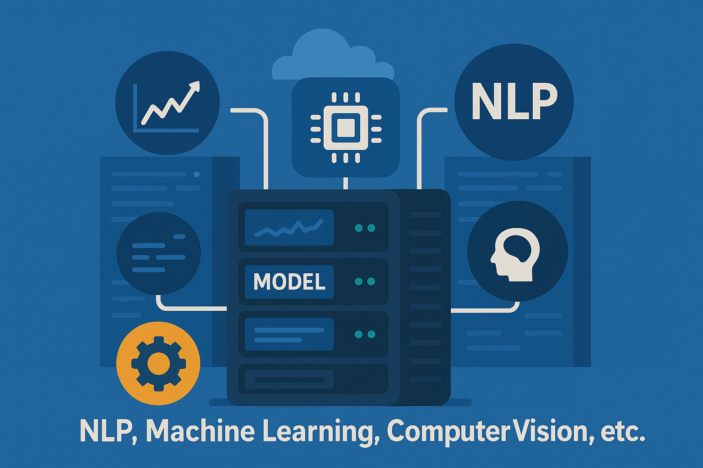

    

 

     
    

##    Artificial Intelligence

Central repository for AI projects such as Predictive and Classification Models, Natural Language Processing (NLP), Machine Learning, Computer Vision, etc.
